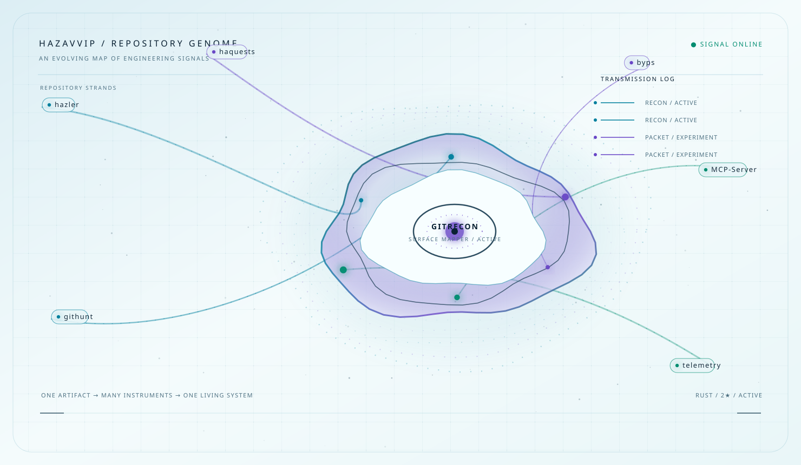

<div align="center">

<a href="https://github.com/HazaVVIP/GitRecon">
<picture>
  <source media="(min-width: 769px) and (prefers-color-scheme: dark)" srcset="./assets/genome/repository-genome-dark.svg">
  <source media="(min-width: 769px) and (prefers-color-scheme: light)" srcset="./assets/genome/repository-genome-light.svg">
  <source media="(max-width: 768px) and (prefers-color-scheme: dark)" srcset="./assets/genome/repository-genome-mobile-dark.svg">
  <source media="(max-width: 768px) and (prefers-color-scheme: light)" srcset="./assets/genome/repository-genome-mobile-light.svg">
  
</picture>
</a>

</div>

<h1 align="center"><code>HazaVVIP / REPOSITORY GENOME</code></h1>

<p align="center">
  <strong>I build instruments for finding what hides in systems.</strong><br>
  <sub>an evolving map of engineering signals · public work · open experiments</sub>
</p>

<p align="center">
  <a href="https://github.com/HazaVVIP/GitRecon">ENTER GITRECON</a> ·
  <a href="https://github.com/HazaVVIP?tab=repositories">VIEW ALL SIGNALS</a> ·
  <a href="https://github.com/HazaVVIP/HazaVVIP/issues">SEND A SIGNAL</a>
</p>

## The entry point

Every system has a surface. **[GitRecon](https://github.com/HazaVVIP/GitRecon)** is the first instrument in this profile: a Rust-based public engineering artifact for discovering, mapping, and observing systems. The genome above treats it as an entry point rather than a card. The surrounding strands show the instruments that extend the same line of inquiry.

> **One artifact → many instruments → one living system.**

The visual is generated from repository metadata and a curated relationship model. Stars, language, state, and update time influence signal weight, while the human-authored role and mission preserve meaning that raw GitHub metadata cannot provide.

## Follow the signal

| Phase | What happens | Instruments |
| --- | --- | --- |
| **01 / RECON** | Discover the perimeter, map the surface, observe the shape. | [GitRecon](https://github.com/HazaVVIP/GitRecon) · [hazler](https://github.com/HazaVVIP/hazler) · [githunt](https://github.com/HazaVVIP/githunt) |
| **02 / PACKET** | Inspect the boundary, craft requests, test the response. | [haquests](https://github.com/HazaVVIP/haquests) · [byps](https://github.com/HazaVVIP/byps) · [CVE-2025-30208](https://github.com/HazaVVIP/CVE-2025-30208) |
| **03 / AUTOMATION** | Connect the instruments, record the signal, ship the next experiment. | [MCP-Server](https://github.com/HazaVVIP/MCP-Server) · [manus](https://github.com/HazaVVIP/manus) · [telemetry](https://github.com/HazaVVIP/telemetry) |

## Featured artifact: GitRecon

<div align="center">

[](https://github.com/HazaVVIP/GitRecon)
[](https://github.com/HazaVVIP/GitRecon)
[](https://github.com/HazaVVIP/GitRecon)

</div>

GitRecon is the profile's narrative anchor. It is intentionally introduced before the global telemetry so visitors encounter a concrete artifact first, then understand the larger repository system around it.

## Instrument shelf

| Repository | Role | State |
| --- | --- | --- |
| [hazler](https://github.com/HazaVVIP/hazler) | Next-generation intelligent web crawler | Active |
| [githunt](https://github.com/HazaVVIP/githunt) | Discovery utility for the perimeter | Active |
| [haquests](https://github.com/HazaVVIP/haquests) | Low-level packet crafting | Experiment |
| [byps](https://github.com/HazaVVIP/byps) | Protocol research and response probing | Experiment |
| [MCP-Server](https://github.com/HazaVVIP/MCP-Server) | AI bridge and tool connection | Active |
| [telemetry](https://github.com/HazaVVIP/telemetry) | Web telemetry experiment | Experiment |

## Contribution transmission

<div align="center">

<picture>
  <source media="(prefers-color-scheme: dark)" srcset="https://raw.githubusercontent.com/HazaVVIP/HazaVVIP/output/snake-dark.svg">
  <source media="(prefers-color-scheme: light)" srcset="https://raw.githubusercontent.com/HazaVVIP/HazaVVIP/output/snake-light.svg">
  
</picture>

</div>

<details>
<summary><code>open telemetry</code></summary>

<br>

<div align="center">

<picture>
  <source media="(prefers-color-scheme: dark)" srcset="https://streak-stats.demolab.com/?user=HazaVVIP&hide_border=true&background=030711&stroke=62EEFF&ring=A88BFF&fire=66F2BE&currStreakLabel=62EEFF&sideLabels=7395AD&currStreakNum=EAFBFF&sideNums=EAFBFF&dates=7395AD&titleColor=62EEFF&card_width=1180">
  <source media="(prefers-color-scheme: light)" srcset="https://streak-stats.demolab.com/?user=HazaVVIP&hide_border=true&background=F4FBFC&stroke=007F9D&ring=6946C6&fire=008C70&currStreakLabel=007F9D&sideLabels=4E7182&currStreakNum=092032&sideNums=092032&dates=4E7182&titleColor=007F9D&card_width=1180">
  
</picture>

</div>

</details>

## Toolchain

<p align="center">
  
</p>

## Contact

<p align="center">
  <a href="https://github.com/HazaVVIP">GitHub</a> ·
  <a href="https://github.com/HazaVVIP?tab=repositories">Repositories</a> ·
  <a href="https://github.com/HazaVVIP/HazaVVIP/issues">Issues</a>
</p>

<details>
<summary><code>operator notes</code></summary>

<br>

This profile is rendered from public GitHub data plus a small, human-authored relationship model. To rebuild locally:

```bash
python3 scripts/fetch_profile_data.py
python3 scripts/render_repository_genome.py
python3 scripts/render_signal_array.py
python3 scripts/render_lab.py
python3 scripts/validate_assets.py
```

The generated Genome assets live in `assets/genome/`; `assets/fallback/` keeps compatibility copies for the earlier profile engine. The workflow refreshes public telemetry with the built-in Actions token and never stores a personal credential.

</details>
