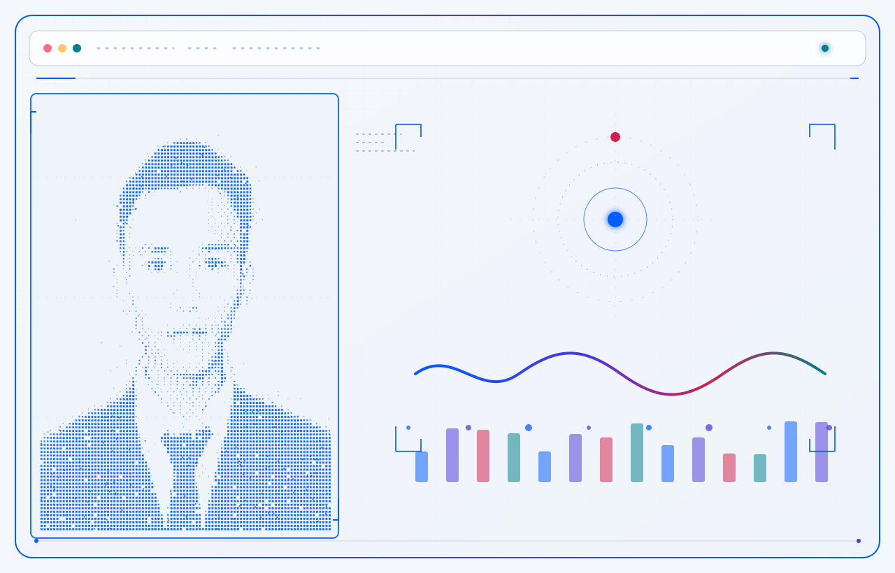

<a href="https://github.com/HazaVVIP">
<picture>
  <source media="(prefers-color-scheme: dark)" srcset="./assets/portrait/portrait-terminal-dark.svg">
  <source media="(prefers-color-scheme: light)" srcset="./assets/portrait/portrait-terminal-light.svg">
  
</picture>
</a>

 

<a href="https://github.com/HazaVVIP/GitRecon">
<picture>
  <source media="(prefers-color-scheme: dark)" srcset="./assets/portrait/signal-icons-dark.svg">
  <source media="(prefers-color-scheme: light)" srcset="./assets/portrait/signal-icons-light.svg">
  
</picture>
</a>

 

<a href="https://github.com/HazaVVIP">
<picture>
  <source media="(prefers-color-scheme: dark)" srcset="https://raw.githubusercontent.com/HazaVVIP/HazaVVIP/output/snake-dark.svg">
  <source media="(prefers-color-scheme: light)" srcset="https://raw.githubusercontent.com/HazaVVIP/HazaVVIP/output/snake-light.svg">
  
</picture>
</a>

 

