<div align="center">

<picture>
  <source media="(prefers-color-scheme: dark)" srcset="./assets/generated/signal-array-dark.svg">
  <source media="(prefers-color-scheme: light)" srcset="./assets/generated/signal-array-light.svg">
  
</picture>

</div>

<h2 align="center"><code>HazaVVIP // systems-intelligence-lab</code></h2>

<p align="center">
  <a href="https://github.com/HazaVVIP/GitRecon">RECON</a> ·
  <a href="https://github.com/HazaVVIP/haquests">PACKET</a> ·
  <a href="https://github.com/HazaVVIP/MCP-Server">AUTOMATION</a>
</p>

<p align="center">
  I build tools for discovery, systems research, automation, and learning in public.
</p>

## Signal briefing

This profile is a living map of experiments, utilities, and open-source artifacts. The visual language is built as a **signal array**: repositories become artifacts, engineering domains become orbital channels, and contribution history becomes a transmission waveform.

The hero above is generated from `profile.config.json` and `data/profile.json` by `scripts/render_signal_array.py`. It is intentionally asymmetric and layered rather than a grid of equal dashboard cards. The static information layer remains complete even when GitHub does not play optional SVG motion.

## Signal channels

| Domain | Focus | Selected artifacts |
| --- | --- | --- |
| **RECON** | Discover, map, and observe systems | [GitRecon](https://github.com/HazaVVIP/GitRecon), [hazler](https://github.com/HazaVVIP/hazler), [githunt](https://github.com/HazaVVIP/githunt) |
| **PACKET** | Inspect, craft, and test protocols | [haquests](https://github.com/HazaVVIP/haquests), [byps](https://github.com/HazaVVIP/byps), [CVE-2025-30208](https://github.com/HazaVVIP/CVE-2025-30208) |
| **AUTOMATION** | Connect, observe, and ship tools | [MCP-Server](https://github.com/HazaVVIP/MCP-Server), [manus](https://github.com/HazaVVIP/manus), [telemetry](https://github.com/HazaVVIP/telemetry) |

## Contribution signal

<div align="center">

<picture>
  <source media="(prefers-color-scheme: dark)" srcset="https://raw.githubusercontent.com/HazaVVIP/HazaVVIP/output/snake-dark.svg">
  <source media="(prefers-color-scheme: light)" srcset="https://raw.githubusercontent.com/HazaVVIP/HazaVVIP/output/snake-light.svg">
  
</picture>

</div>

## External telemetry

<div align="center">

<picture>
  <source media="(prefers-color-scheme: dark)" srcset="https://streak-stats.demolab.com/?user=HazaVVIP&hide_border=true&background=07111F&stroke=22D3EE&ring=A78BFA&fire=34D399&currStreakLabel=22D3EE&sideLabels=8BA7B8&currStreakNum=F8FAFC&sideNums=F8FAFC&dates=64748B&titleColor=22D3EE&card_width=1180">
  
</picture>

<br>

<picture>
  <source media="(prefers-color-scheme: dark)" srcset="https://github-stats-extended.vercel.app/api?username=HazaVVIP&show_icons=true&hide_rank=true&hide_border=true&title_color=22D3EE&icon_color=A78BFA&text_color=94A3B8&bg_color=07111F&card_width=500">
  
</picture>
<picture>
  <source media="(prefers-color-scheme: dark)" srcset="https://github-stats-extended.vercel.app/api/top-langs/?username=HazaVVIP&layout=compact&langs_count=8&hide_border=true&title_color=22D3EE&text_color=94A3B8&bg_color=07111F&card_width=500">
  
</picture>

</div>

## Toolchain

<p>
  
</p>

## Contact

<p>
  <a href="https://github.com/HazaVVIP">GitHub</a> ·
  <a href="https://github.com/HazaVVIP?tab=repositories">Repositories</a>
</p>

<details>
<summary><code>operator-notes</code></summary>

<br>

The generated assets live in `assets/generated/`, while `assets/fallback/` keeps a static copy for compatibility testing. To rebuild locally:

```bash
python3 scripts/fetch_profile_data.py
python3 scripts/render_signal_array.py
python3 scripts/render_lab.py
python3 scripts/validate_assets.py
```

</details>
